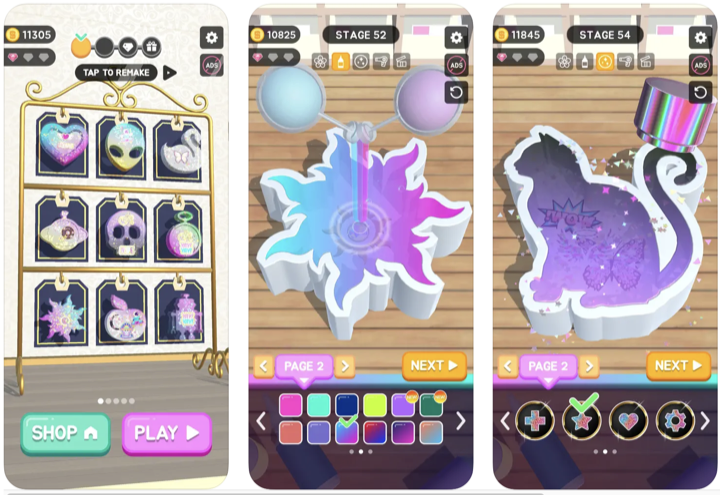
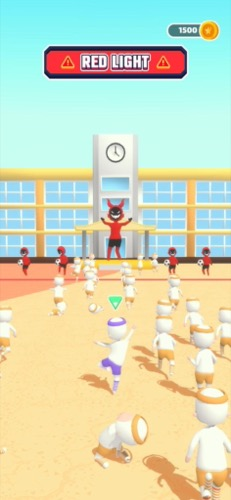
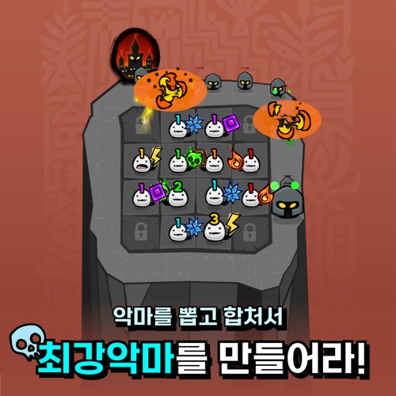
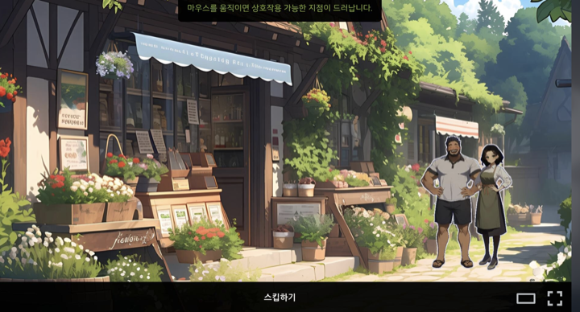
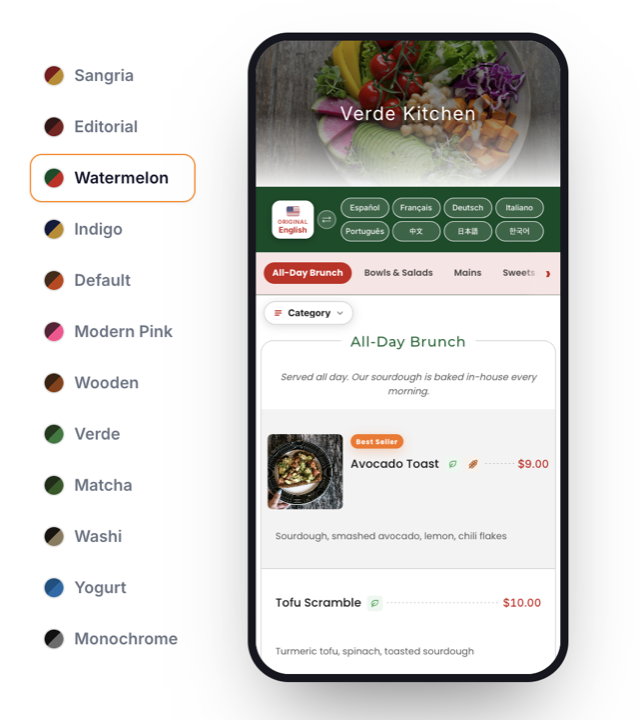

# Jin Hyung KANG (aka Sayne)

Game & Software Developer. Unity, mobile, and web. Based in Seoul, working remote.

- 30+ mobile titles shipped with six publishers (2019~2025):
  - 🇫🇷 Voodoo
  - 🇻🇳 Amanotes
  - 🇫🇷 Homa Games
  - 🇵🇱 BoomHits
  - 🇺🇸 Lion Studios
  - 🇰🇷 Supercent
- Solo-developed **The Secret Of Greenwood Isle**, a story adventure, over one year and released it on Steam and STOVE
- Currently building and running **Modu Dining**, a live multilingual restaurant menu service with an LLM translation pipeline

Portfolio, including a WebGL game you can play right in the browser: **[developersayne.dev](https://developersayne.dev)**

## Selected work

| Project | Year | What it is |
|---|---|---|
| **Demolding 3D** | 2020 | Development lead. Published by Homa Games. 2M+ estimated downloads (AppMagic). |
| **K-Games 3D** | 2021 | Development lead. Published by BoomHits. CPI $0.03 in testing. |
| **Hell Keeper** | 2025 | Solo. Slot-defense mobile game, released on ONE Store and playable as WebGL. |
| **The Secret Of Greenwood Isle** | 2025~26 | Solo development, one year. Released on [Steam](https://store.steampowered.com/app/3790450/The_Secret_Of_Greenwood_Isle/) and STOVE. |
| **Modu Dining** | 2026~ | Live restaurant web service. Next.js, Supabase, LLM pipeline. [modudining.com](https://www.modudining.com) |

 
**Demolding 3D** — mold-shaping puzzle, hypercasual.

 
**K-Games 3D** — Korean traditional games in 3D, shipped during the Squid Game surge.

 
**Hell Keeper** — draw heroes from a slot, merge them, hold the waves.

 
**The Secret Of Greenwood Isle** — story adventure with branching routes.

 
**Modu Dining** — QR menu in 8 languages, themed per restaurant.

## Code

Most of my shipped work is under publisher contracts or commercial releases, so those sources stay private. The public part lives in these repositories:

- [greenwood-isle-excerpts](https://github.com/kangbba/greenwood-isle-excerpts): story engine, save/restore and the node-graph editor the narrative is authored in, from my Steam release.
- [hell-keeper-excerpts](https://github.com/kangbba/hell-keeper-excerpts): script source of a released mobile game (ONE Store), art and audio excluded, playable as WebGL on my portfolio site.
- [bangawer-voice-translator-excerpts](https://github.com/kangbba/bangawer-voice-translator-excerpts): a custom ESP32 translator device with its Flutter app in one repo. ESP-ADF audio pipelines over HFP, a BLE control channel, and the app that drives it.
- [modu-dining-excerpts](https://github.com/kangbba/modu-dining-excerpts): source excerpts from Modu Dining, the live service above. The menu data model shared by the site, the owner console and the AI pipeline, plus the pipeline's task graph.

## Stack

- **Games**: Unity, C#, UniRx, UniTask, DOTween. Ships to Android, iOS, PC and WebGL
- **Mobile**: Android (Java/Kotlin), Flutter. Release ops on App Store Connect, Google Play Console, Steamworks
- **Web**: Next.js, TypeScript, Tailwind, Supabase, Vercel
- **Hardware**: Arduino, ESP32 (ESP-IDF, ESP-ADF)

## Contact

sayneinteractive@gmail.com
